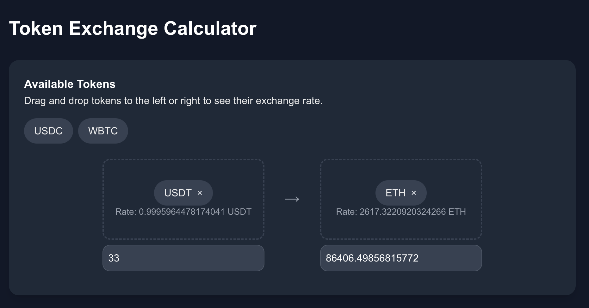

# Crypto Token Swap Interface 💱

A modern web interface for comparing cryptocurrency values, featuring drag-and-drop token selection and real-time price calculations.

[](https://your-vercel-app.vercel.app)



## Features ✨
- 🖱️ Drag-and-drop token selection
- 💵 USD value conversion
- 📱 Responsive design
- 🚀 Next.js 14 optimized

## Tech Stack 🛠️
- **Frontend**: Next.js 14, React 18, TypeScript
- **Styling**: Tailwind CSS
- **API**: Fun.xyz Crypto API
- **Deployment**: Firebase

## Getting Started 🚀

### Prerequisites
- Node.js ≥18.x
- npm ≥9.x
- Fun.xyz API Key

### Installation
```bash
# Clone repository
git clone https://github.com/yourusername/token-swap.git

# Install dependencies
npm install

# Run development server
npm run dev